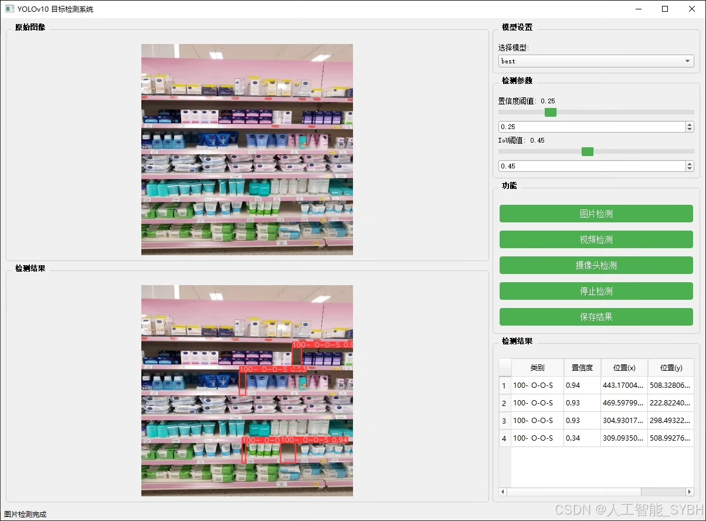
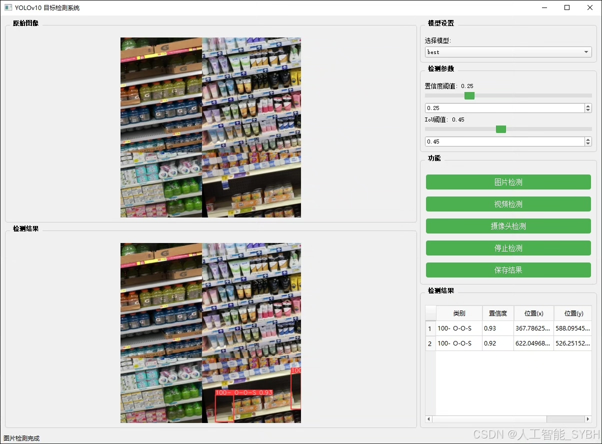
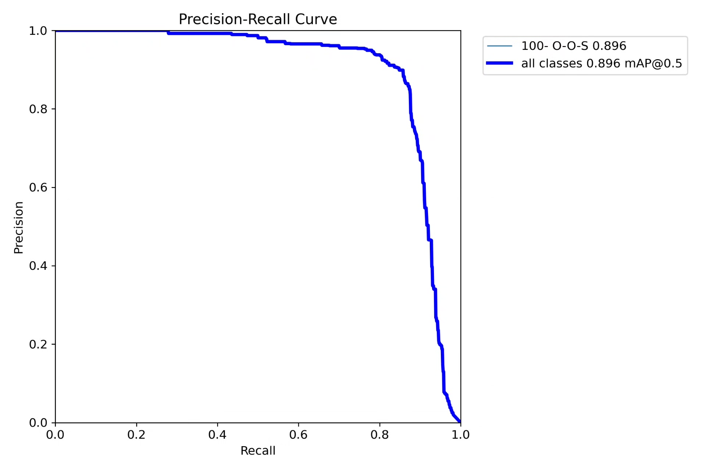
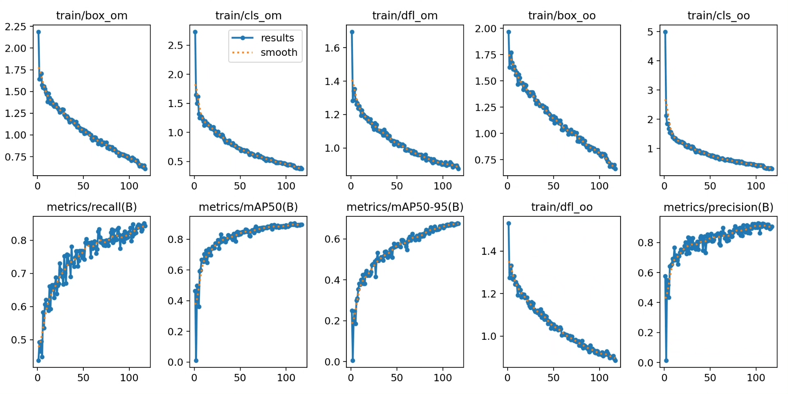
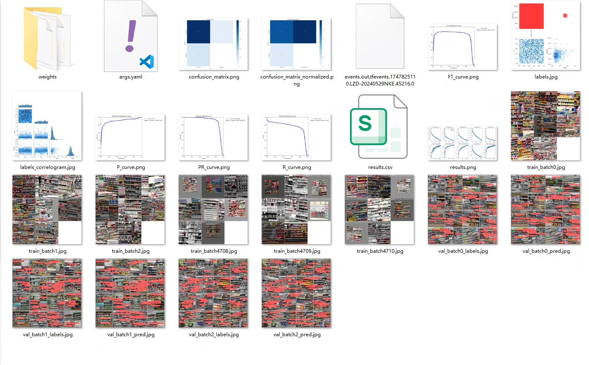
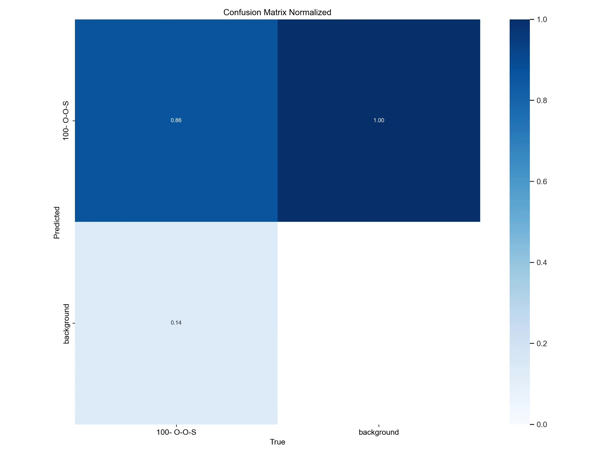
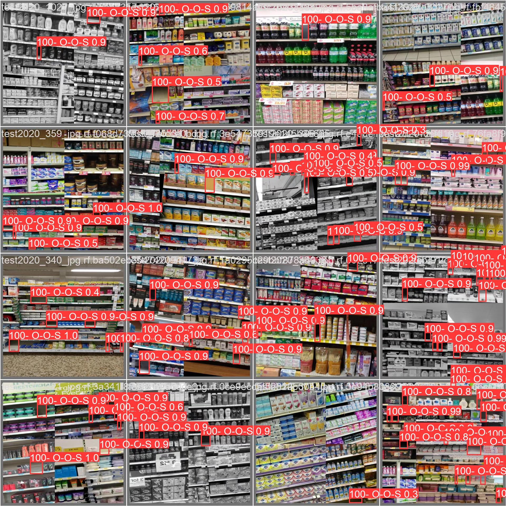

# Based on deep learning YOLOv10 for supermarket empty shelf detection system

## Body

This project is based on the YOLOv10 object detection framework, developing a smart empty shelf recognition system specifically for the retail industry. It can accurately detect the out-of-stock status (labeled as "100-O-O-S") on supermarket shelves. The system uses a professional dataset of shelf images for training and evaluation. Through special optimizations for retail scenarios, this system achieves high-precision real-time detection of out-of-stock status on supermarket shelves, providing an intelligent solution for retailers' inventory management, restocking optimization, and sales analysis. The system maintains stable detection performance in complex supermarket environments and can adapt to different shelf types, product categories, and store lighting conditions, significantly enhancing the efficiency and accuracy of traditional manual inspections.

The company's products have obtained YOLO official commercial license certification.

We provide after-sales service.

After payment, we will provide WeChat ID for any questions.

Environment configuration: We will provide a tutorial on environment configuration, and WeChat will provide answers to questions.

Remote installation service: If you need remote configuration, an additional fee of 69 is required.
If the configuration fails, all fees will be refunded (only the installation fee is refunded for older computers).

Retraining dataset: After setting up the environment, you can train on your own computer.
If you need us to train it, just pay 69 plus computing power fees (2.5 yuan/hour)

## Images

## Payment

Here is a pay link on Stripe ( https://buy.stripe.com/3cs8yP7sY87d0vu9AB ). Please contact me lonlonago@foxmail.com after funding $89, and I will send you a complete data files , thank you!

